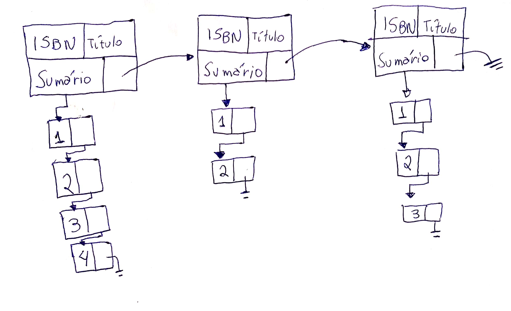
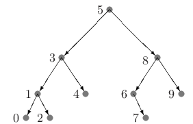

# Exercício 6 (Resolução)
## SCC0223 - Estruturas de Dados I 
### Francisco Rosa Dias de Miranda
##### Outubro de 2020

* * *

## Problema 1: Setor de manutenção de peças

### Proposta: Fila de prioridade

Os dados de cada peça que vai para reparo são passados para as rotinas de execução através de uma estutura de dados tipo `PEÇA`. No caso da equipe A, as peças não possuem prioridade.

```` c 
    struct PEÇA
     {
    //  Prioridade de uma peça
        union
            int prioridade
    
    //  Código de identificação de uma peça
        int id
        
    //  Próxima peça da lista
        PEÇA * prox
    }
````
As requisições de serviço das equipes serão armazenadas em estruturas de dados do tipo fila: este tipo de dado abstrato favorece a rotina de execução dos projetos devido ao processamento em ordem de chegada dos elementos ocorrer em tempo constante.

No caso da Equipe B, optamos por uma variações do algoritmo de uma fila em nossa implementação conhecida como ***fila de prioridade***: a inserção de cada elemento na fila ocorre de forma a também levar em consideração sua prioridade.

Assim, elementos com alta prioridade são armazenados no início da lista, e são os primeiros a sair; enquanto serviços de baixa prioridade vão para o final da fila.

#### Protótipos das funções envolvidas
```` c
// Aloca dinamicamente e inicializa uma fila.  @retorno o endereço da FILA criada.
FILA * criaFila();

// Recebe o endereço de um elemento do tipo FILA * e desaloca-o da memória
void excluifila(FILA ** f);

// Insere uma peça p numa fila f.  @retorna TRUE ao inserir corretamente.
bool insereServico(PEÇA p, FILA f);

// Recebe uma fila e retorna o próximo serviço da equipe.
PEÇA proximoServico(FILA f);

// recebe uma PEÇA de uma FILA, remove-a e gera seu relatorio.
// @retorno TRUE caso tenha êxito
bool executaServico(PEÇA p, FILA f);

// Imprime o relatorio da fila aberta.
void informaFila(FILA f);
````
#### Rotina de execução

No começo do dia a aplicação é iniciada, inicializando as filas das equipes A e B com um respectivo chamado da função `criaFila`, que aloca a fila dinamicamente.

As ordens de serviço são inseridas com a função `insereServico`; no final da fila de cada equipe e também conforme sua prioridade, no caso da equipe B. Assim como a fila, cada peça é alocada dinamicamente.

Uma equipe pode exibir o próximo serviço a ser executado com o método `proximoServico`. Após executá-lo, com a função `executaServico` o usuário gera um relatório no sistema, que remove a peça da fila e desaloca-a da memória.

Ao final do dia, as peças pendentes são salvas em relatório e desalocadas da memória para que a aplicação seja encerrada, com auxílio das funções `informaFila` e `exluiFila`.


#### Eficiência das funções

| Operação | Complexidade |
|:-:|:-:|
| Inserção | $O(1)$ |
| Remoção | $O(1)$ |
| Exclusão | $O(n)$ |
| Consulta | $O(1)$ |
| Execução | $O(1)$ |
| Relatório | $O(n)$ |
 
* * *

## Problema 2: Estacionamento de carros

### Proposta: Fila estática circular

Um carro, ao chegar no estacionamento, só é o próximo a sair se ele é o único carro estacionado; caso contrário é necessário mover todos os carros estacionados antes de mover este último -  optamos novamente pela utilização de uma fila por conta da dinâmica do problema ser da forma FIFO (first in, first out).

Nesta abordagem, criamos um vetor estático de tamanho 10, o número máximo de veículos dentro do estacionamento, que armazena um objeto do tipo `carro`, juntamente com um TAD do tipo `fila`, que registra o índice da posição inicial e a final da fila dentro do vetor.

Essa característica é o que podemos denominar como fila circular: se `inicio = fim` a fila está vazia, e se `inicio = fim - 1`, ela está cheia. Dessa forma, só movemos os elementos dentro do vetor caso seja realmente necessário. 

```` c

    struct carro
    {
        char[7] placa;
        int horario;
    }

    struct fila
    {
        int inicio;
        int fim;
    }

````
```` c
    // registra as entradas de carros
    // @retorno TRUE se o carro pode entrar
    //          FALSE se o estacionamento estiver cheio            
    boolean entraCarro(carro c, fila f);

    // @retorno numero de carros a ser movido para viabilizar a saída
    int nSaidas(carro c, fila f);

    // retira um carro e move toda a fila.
    // @retorno TRUE caso a operação funcione 
    boolean retiraCarro(carro c, fila f);

    // @retorno numero de carros estacionados
    int nCarros(fila f);

```` 
### Rotina de Execução

Cria um vetor `carro[10]` e uma estrutura do tipo `fila`, que serão passados como argumento para as funções.

Ao chegar um novo carro, é feito um chamado da função `entraCarro()`, caso retorne `FALSE`, o carro não entra.

Para viabilizar uma saída, utilizamos a função `nSaidas()`. Para efetivá-la, recorremos ao método `retiraCarro()`.

A qualquer momento podemos consultar o número de carros no estacionamento através da função `nCarros`,

### Complexidade

A escolha de uma fila circular estática dá-nos vários ganhos:
- Operações como a inserção, verificação de fila cheia e de tamanho são diretas: através da comparação dos inteiros `inicio` e `fim`, o que evita que percorramos toda a fila desnecessariamente.
- Só é necessário percorrer toda a fila quando removemos um carro que não seja o próximo a sair. No pior caso, executaremos 9 remoções (ou $n-1$ no caso geral).
- A fila estática evita que façamos operações de alocação, pois já sabemos de antemão o tamanho máximo da fila. Contudo, tal ganho não é tão significativo, dada a baixa dimensionalidade do problema.

* * *

## Problema 3: Biblioteca Virtual

### Proposta: Lista ligada

Como não sabemos de antemão a quantidade de livros no catálogo, optamos por utilizar alocação dinâmica de memória, através uma **lista ligada simples**:


```` c
    struct capitulos
    {
        int capítulo;
        capitulos * proximo;
    }

    struct livro
    {
        int ISBN;
        char[TAM_MAX] título;
        capitulos * inicio;
        livro * proximo;
    }

    struct catalogo
    {
        livro * inicio;
        int tamanho;
    }
````

Aqui, os capítulos de cada livro são armazenados também em uma lista ligada alocada dinâmicamente, no caso apenas com o capítulo do respectivo livro, mas que poderia ser expandida de forma a conter, por exemplo, o texto de cada capítulo.




Examinemos agora algumas características do problema:

- as pessoas consultarão o catálogo de livros muitas vezes,
- dificilmente haverão remoções, e
- uma vez que a base seja cadastrada, haverá muito menos inserções do que buscas.

Dito isso, note que a solução proposta pode não ser a mais eficiente. Pois, do ponto de vista prático, queremos privilegiar as operações de busca, mas sua complexidade está escalando linearmente conforme a número de livros aumenta.


### Proposta 2: listas em árvore

Como forma de contornar o problema descrito acima poderíamos adotar algum critério de ordenação na lista, como por exemplo através do ISBN.

Utilizando as estruturas de livro definidas na Proposta 1, vamos agora definir um nó da lista generalizada de nosso catálogo de outra forma:

```` c
    struct NÓ
    {
        livro * l;
        NÓ * esquerda;
        NÓ * direita;
    }
````
Considere o conjunto ordenado formado a de acordo com os ISBNs dos livros. De acordo com Feofiloff, em uma **árvore de busca** a ordem esquerda-registro-direita das chaves é *crescente*, e ainda:

> Uma árvore binária é **balanceada** se, em cada um de seus nós, as subárvores esquerda e direita tiverem aproximadamente a mesma altura. Uma árvore binária balanceada com $n$ nós tem altura próxima de $log n$. 



Note que, agora, utilizando uma árvore de busca balanceada, essa propriedade nos permite realizar buscas em complexidade $O(logn)$. Contudo, temos o tradeoff de ser necessário reconstruir a árvore a cada inserção ou remoção de um livro do catálogo.

## Referências

- Paulo Feofiloff. *Projeto de Algoritmos em C*. Disponível em https://www.ime.usp.br/~pf/algoritmos/index.html. Acesso em: 15 out. 2020.

