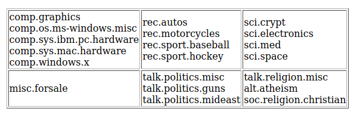
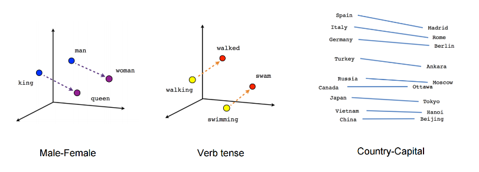
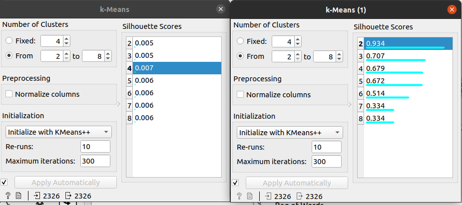
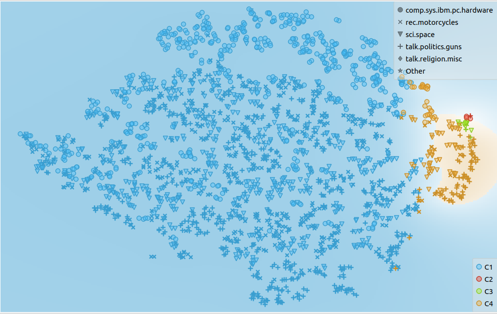
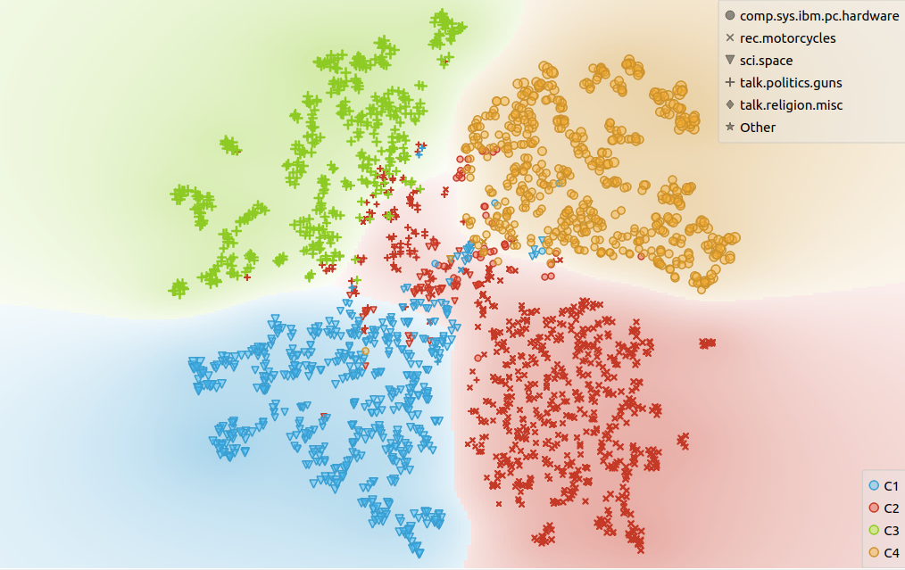
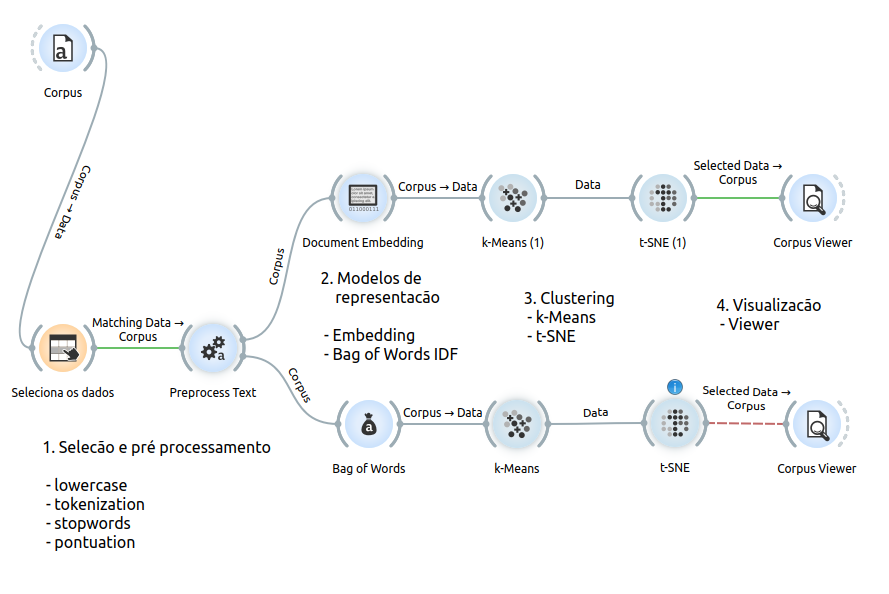

# Análise de texto em 20NewsGroups

## Objetivo

Nosso objetivo é encontrar clusters de documentos através do método de K-Means, através dos modelos de representação de documentos de Embedings e Bag of Words, e comparar os resultados dos dois métodos através da projeção dos clusters com o t-SNE.

Para tanto, utilizaremos o software open-source **Orange**, baseado em Python, que fornece um panorama de todo o pipeline de Ciência de Dados utilizado para esta análise, sem a necessidade de se escrever códigos.

## Conjunto de dados

Esta base de dados, originalmente parte do pacote *Scikit-learn*, contém 11.293 posts em grupos de notícias de 20 diferentes tópicos, subdivididos em 6 assuntos, conforme ilustrado na Figura 1.

Nesta análise, utilizaremos somente os temas talk.politics.guns, comp.sys.ibm.pc.hardware, sci.space e rec.motorcycles, que tratam, respectivamente, de políticas armamentistas, hardware de PCs, espaço sideral e motocicletas.

##  Seleção e pré-processamento

Primeiramente, utilizamos a função *Select Rows* para filtrar o conjunto de dados e utilizar somente os temas acima mencionados. Utilizamos o critério "is one of", pois queremos selecionar as quatro categorias de textos simultaneamente.

Após manter somente as categorias de interesse em nosso conjunto de dados, efetuaremos o pré-processamento dos textos, em que descreveremos sucintamente cada etapa a seguir.

#### Funções de pré-processamento de texto utilizadas

- **Transformação:** lowercase

Deixa todo o texto em minúsculas para que possa ser lido de maneira uniforme pelo algoritmo de classificação não supervisionado.

- **Tokenização:** Regexp

Transforma cada palavra distinta em uma chave numérica (token), fazendo que o texto seja mais facilmente lido pelo computador.

- **Filtragem:** remove stop words
  
Stop words são conectivos da língua, como preposições, artigos e conjunções, que não contribuem como fonte de informação para a análise textual, sendo portanto removidas.

- **Filtragem:** Regexp

Utilizamos a função de processamento de expressões regulares aqui para remover todos os símbolos de pontuação presentes nos textos, pois eles também não agregam valor para nossa análise.

## Modelos de representação de documentos

### Bag of Words

O bag of words é uma estratégia de representação do texto em que a sequência de palavras é desconsiderada, simplificando o texto para uma lista de palavras distintas e sua respectiva frequência.

Como principal vantagem dessa estratégia temos a simplicidade de representação computacional, sendo atrativa para a aplicação direta de algoritmos de aprendizado de máquina.

Contudo, para se obter uma melhor eficiência, é necessário aplicar outras técnicas que mitiguem a perda de informação, como a já realizada remoção de stop words.

Também podemos citar técnicas como a lematização e TF-IDF, que contribuem significativamente para este método.

### Word Embeddings

Esta estratégia de representação mapeia, através de técnicas de aprendizado não-supervisionado, um vetor de $n$ coordenadas de números reais a cada palavra do corpus.

Isso permite que palavras usadas em contextos similares tenham uma representação similar no espaço $n$-dimensional, conforme ilustrado na Figura 2.

## Clustering

Em nosso contexto, o processo de agrupamento (clustering) procura agrupar textos sobre o mesmo assunto e separar os de conteúdo diferente. A cada conjunto de dados resultante do processo dá-se o nome de grupo, aglomerado ou agrupamento (cluster).

Existem diversas técnicas de clustering, neste trabalho utilizaremos apenas a conhecida como **k-Means**. Aqui, a meta é particionar nossas $n$ observações em $k$ clusters distintos. Como parâmetro, devemos escolher $k$. 

Devido a essa escolha impactar diretamente na eficiência do algorítimo, existem diversas técnicas e heurísticas para fazer essa escolha. Por questões de simplicidade, trabalharemos aqui com $k=4$, que foi o número de categorias selecionadas. A Figura 3 ilustra os scores para diferentes valores de $k$.

Junto ao k-Means, é aplicada uma técnica de TF-IDF, que é uma técnica estatística que, em nosso contexto, indica a importância de uma palavra em relação ao corpus.

### Redução de dimensionalidade (t-SNE)

O **t-SNE** é um algoritmo para visualização de dados com alta dimensionalidade. Através dele, iremos visualizar os clusters resultantes das transformações nos dados.

A Figura 4 ilustra os clusters obtidos através do document embeding para nosso conjunto de dados. Note que, apesar dos altos scores de silhueta, o modelo não foi capaz de separar adequadamente os dados para $k=4$.

A Figura 5 ilustra os clusters obtidos através do Bag of Words. Como podemos ver, o modelo abaixo consegue separar mais adequadamente os dados que o anterior, apesar de seu baixo score de silhueta, para $k=4$.
 

## Conclusão

Como pudemos ver, a técnica do Bag of Words com TF-IDF foi a mais efetiva que o Embedding para clusterizar os dados dado o $k$ escolhido. A Figura 6 ilustra todo o pipeline do processo descrito nesse relatório.

## Referências

Tf–idf. (2018, novembro 10). Wikipédia, a enciclopédia livre. Retrieved 17:47, novembro 10, 2018 from https://pt.wikipedia.org/w/index.php?title=Tf%E2%80%93idf&oldid=53557110. 

Wikipedia contributors. (2020, September 24). T-distributed stochastic neighbor embedding. In Wikipedia, The Free Encyclopedia. Retrieved 00:51, October 7, 2020, from https://en.wikipedia.org/w/index.php?title=T-distributed_stochastic_neighbor_embedding&oldid=980150639

PEDRO IGOR DE ARAÚJO OLIVEIRA, BRUNO VIEIRA COSTA, LUCAS RICARTE ROGÉRIO TEIXEIRA. FERRAMENTA DE CLASSIFICAÇÃO DE QUESTÕES PARA AUXÍLIO AO APRENDIZADO. disponível em http://www.comp.ime.eb.br/graduacao/pfc/repositorio-pfc/2018/PFC%20-%20Ricarte.pdf

Clustering. (2020, abril 16). Wikipédia, a enciclopédia livre. Retrieved 19:50, abril 16, 2020 from https://pt.wikipedia.org/w/index.php?title=Clustering&oldid=58054039. 

Wikipedia contributors. (2020, September 24). K-means clustering. In Wikipedia, The Free Encyclopedia. Retrieved 00:55, October 7, 2020, from https://en.wikipedia.org/w/index.php?title=K-means_clustering&oldid=980067381

