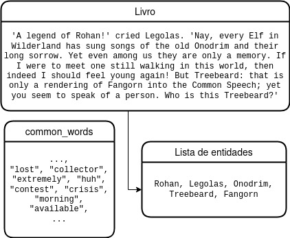
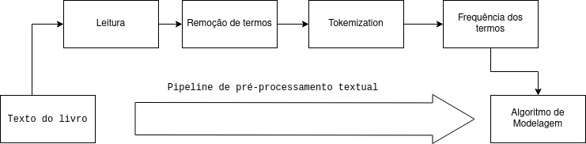
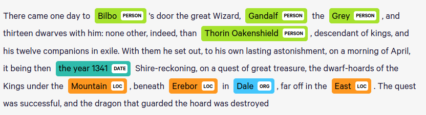
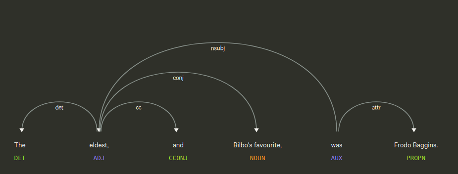
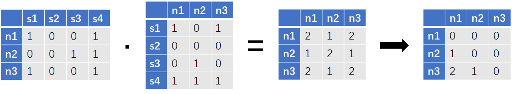
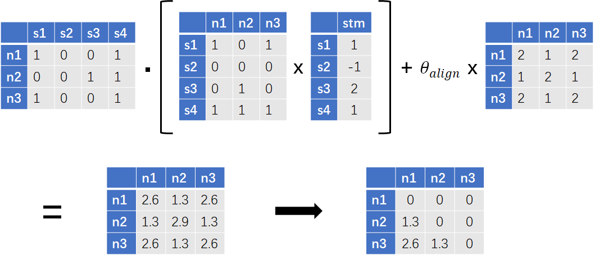
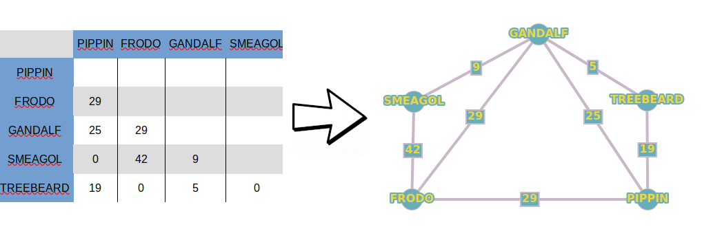

background-image: url("https://static2.srcdn.com/wordpress/wp-content/uploads/2019/09/Gandalf-Magic.jpg?q=50&fit=crop&w=960&h=500")
background-position: 10% 10%
class: center, bottom, inverse

### "I am looking for someone to share in an adventure that I am arranging, and it’s very difficult to find anyone!"

---

## Conjunto de dados
Nosso *corpus* consiste em três arquivos `.txt` retirados da plataforma *Kaggle*, cada um contendo o texto de um volume da trilogia *The Lord of the Rings*.

--

## Motivacão
- Modelar dados textuais usando informacões presentes na trama.
--
- Utilizar modelos não supervisionados de aprendizagem num conjunto de dados já conhecido por nós como uma maneira de validar os resultados.

--

## Desafios de Análise
- Alta dimensionalidade de um corpus textual.
--
- Necessidade de um alto grau de refinamento para a modelagem utilizada, não vista na disciplina.

---

## Objetivo
Nesta atividade, nosso objetivo foi utilizar os conhecimentos adquiridos ao longo da disciplina SCC0652 para **gerar um dashboard de visualização interativa** para nosso *corpus* textual.

--

## Implementação
Utilizamos as funcionalidades do **Jupyter Notebook** para implementar, em linguagem **Python**, nossa aplicação.

---
class: inverse

# **Parte 1**: pré-processamento

### - Filtragem do *corpus* textual

--

# **Parte 2**: modelagem

### - Named Entity Recognition (NER)
### - Network graph

--

# **Parte 3**: criação de um dashboard interativo

### - Jupyter + plot_ly + voilà

---
class: inverse, center, middle

# **Parte 1**: pré-processamento

---


## Leitura:

- Uma coleção de documentos é definida,

- Cada documento pertencente a essa coleção terá seu conteúdo carregado na memória,

- Por questão de limitação de processamento, enviaremos uma frase por vez ao classificador, ao invés do livro completo de uma só vez.
 


---

## Extração e limpeza dos termos:

- **Limpeza**: remoção de uma lista de termos não representativos para o documento. Em nosso caso, foram removidas todas as palavras comuns da língua inglesa presentes no arquivo `common_words.txt`. 

--



---
## Extração e limpeza dos termos:

- **Tokenização**: utilizada para decompor o documento em cada de seus termos de forma que possa ser lido pelo computador. Neste trabalho, utilizamos como delimitadores o espaço em branco entre os termos.

--

- **Contagem dos termos**: Após extrair os termos representativos de cada documento, o número de ocorrências de cada palavra no documento é calculado.

--

```{r echo=F}
entidade <- c('frodo',
  'sam',
  'gandalf',
  'aragorn')

token <- as.integer(runif(4, 10, 100))
  
frequencia <- c(1987,
  1289,
  1121,
  720)
  
 namefreq <- tibble::tibble(entidade,token,frequencia)

 
 knitr::kable(namefreq)

```
---
class: center,middle
# Pipeline de pré-processamento adotado


---
class: inverse, center, middle

# **Parte 2**: modelagem
---

## Reconhecimento de Entidade Mencionada (NER)
--

Sem nenhum conhecimento prévio dos romances, o **modelo de reconhecimento de entidade mencionada** (Named-entity recognition ou NER) encontrará os personagens que fazem parte deles.

Neste projeto, utilizamos o classificador pré treinado `Spacy NER`.

--


---
## Reconhecimento de Entidade Mencionada (NER)

--

- Para cada frase, identificamos as entidades nela mencionadas.

- Se duas entidades estão na mesma frase, contabilizamos a **ocorrência**.

--



---
## Reconhecimento de Entidade Mencionada (NER)
### Matriz de Co-ocorrência

--

- Duas entidades são **co-ocorrentes** se *ocorrem* na mesma sentença.

- A co-ocorrência é **mutualmente iterativa**. Dessa forma, é calculada como:

--

$$X_{coocor} = X_{ocor}^T \cdot X_{ocor}$$

---
## Reconhecimento de Entidade Mencionada (NER)
## Matriz de Sentimentos
### Score Sentimental do Contexto

--

O **sentimento da relação** entre dois personagens é dado num *contexto de co-ocorrência* entre eles, sendo o **score sentimental** atribuído a esse contexto de acordo com a presença de palavras positivas neutras ou negativas.

--
### Taxa de Alinhamento Sentimental

As **descrições de emoções** diferentes de cada autor geram distorções em nossa rede de personagens. 

--

A **Taxa de Alinhamento Sentimental** (Sentiment Alignment Rate) reajusta o *score de sentimento* entre dois personagens toda vez que uma *co-ocorrência* for observada.

---
## Reconhecimento de Entidade Mencionada (NER)
## Matriz de Sentimentos

A **matriz de sentimentos** é calculada da seguinte forma:
- $\theta_{align}$ representa a taxa de alinhamento sentimental,
- $V_{sentiment}$ representa o vetor dos scores de sentimento,
- $V^i_{sentiment}$ representa o $i$-ésimo elemento do vetor de scores, e $N$ seu número de elementos.

--

$$\theta_{align} = -2 \times \frac{\sum V_{sentiment}^i} {N_{V_{sentiment}^i}}, V_{sentiment}^i \neq 0$$

$$X_{sentiment} =  X_{ocor}^T \cdot ( X_{ocor}^T \times V_{sentiment})^T +  X_{coocor} \times \theta_{align}$$
---
## Reconhecimento de Entidade Mencionada (NER)
## Matriz de Sentimentos

O processo é ilustrado abaixo:


---
# Grafo em rede

--

Seja o *grafo não direcionado* $G(V,A)$ definido como:

--

- O **conjunto dos vértices** de $G$, $V(G)$, formado através das **entidades mencionadas** no documento.

--

- O **conjunto das arestas** de $G$, $A(G)$, formado pelos **pares distintos não ordenados** de $V(G)$.

--

- Sejam $u,v$ dois vértices distintos de $G$. A aresta $\{u,v\}$ possui um **peso**, que denota ou o *Score Sentimental* ou o *Score de Co-ocorrência* entre $u$ e $v$.
--

---
class: inverse, center, middle

# **Parte 3**: dashboard interativo

---
# Referências

- Character Network <https://github.com/hzjken/character-network>

- Network Graphs in Python <https://plotly.com/python/network-graphs/>

- Uma Introdução Sucinta à Teoria dos Grafos <https://www.ime.usp.br/~pf/teoriadosgrafos/texto/TeoriaDosGrafos.pdf>

- spaCy Models <https://spacy.io/models>

- Network Diagrams <https://www.data-to-viz.com/#network>

- Python network visualization app using NetworkX, Plotly, Dash <https://github.com/jhwang1992/network-visualization>

- Tolkien, J. R. R. (1991). *The lord of the rings* 

---
class: center, middle, inverse

# Obrigado!

#### Marcos, Luis e Francisco

---
background-image: url("https://static2.srcdn.com/wordpress/wp-content/uploads/2019/05/Bilbo-and-Gandalf.jpg?q=50&fit=crop&w=740&h=370")
class: center, bottom, inverse

### "The world is not in your books and maps. It is out there."
