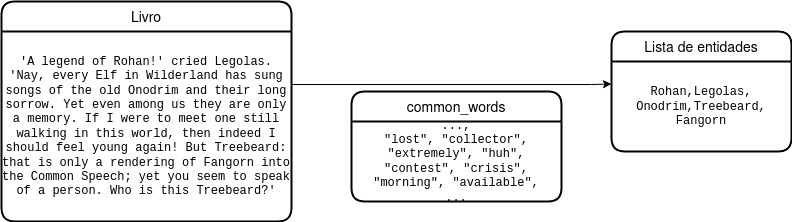

background-image: url("https://static2.srcdn.com/wordpress/wp-content/uploads/2019/09/Gandalf-Magic.jpg?q=50&fit=crop&w=960&h=500")
background-position: 10% 10%
class: center, bottom, inverse

### "I am looking for someone to share in an adventure that I am arranging, and it’s very difficult to find anyone!"

---
class: inverse
# **Parte 0**: preliminares

# **Parte 1**: pré-processamento

### - Filtragem do *corpus* textual

# **Parte 2**: modelagem

### - Named Entity Recognition (NER)
### - Network graph

# **Parte 3**: criação de um dashboard interativo

### - Jupyter + plot_ly + voilà


---
class: inverse, center, middle

# **Parte 0**: preliminares
---

## Objetivo

Nesta atividade, nosso objetivo foi utilizar os conhecimentos adquiridos ao longo da disciplina SCC0652 para **gerar um dashboard de visualização interativa** para nosso *corpus* textual.

--

## Conjunto de dados

Nosso *corpus* consiste em três arquivos `.txt` retirados da plataforma *Kaggle*, cada um contendo o texto de um volume da trilogia *The Lord of the Rings*.

--

## Implementação

Utilizamos as funcionalidades do **Jupyter Notebook** para implementar, em linguagem **Python**, nossa aplicação.


---
class: inverse, center, middle

# **Parte 1**: pré-processamento

---

## Leitura:

- Uma coleção de documentos é definida,

- Cada documento pertencente a essa coleção terá seu conteúdo carregado na memória,

- Por questão de limitação de processamento, enviaremos uma frase por vez ao classificador, ao invés do livro completo de uma só vez.


---

## Extração e limpeza dos termos:

- **Limpeza**: remoção de uma lista de termos não representativos para o documento. Em nosso caso, foram removidas todas as palavras comuns da língua inglesa presentes no arquivo `common_words.txt`. 




---
## Extração e limpeza dos termos:

- **Tokenização**: utilizada para decompor o documento em cada de seus termos de forma que possa ser lido pelo computador. Neste trabalho, utilizamos como delimitadores o espaço em branco entre os termos.


---

## Contagem dos termos:

Após de extrair os termos representativos de cada documento, o número de ocorrências de cada palavra no documento é calculado. Depois de concluída a contagem é criada uma lista com duas colunas: termo e quantidade de ocorrência.

Neste trabalho, utilizaremos o método de contagem mais simples, sem definir peso aos termos, que seria o caso se utilizássemos algo como TF-IDF ou Bag of Words.

```{r echo=F}
names <- c('frodo',
  'sam',
  'gandalf',
  'aragorn',
  'pippin',
  'merry')
  
 freq <- c(1987,
  1289,
  1121,
  720,
  685,
  597)
  
 namefreq <- tibble::tibble(names,freq)

 
 knitr::kable(namefreq)

```
---
class: center,middle
# Pipeline de pré-processamento adotado


---
class: inverse, center, middle

# **Parte 2**: modelagem


---

background-image: url("https://static2.srcdn.com/wordpress/wp-content/uploads/2019/05/Bilbo-and-Gandalf.jpg?q=50&fit=crop&w=740&h=370")
class: center, bottom, inverse

### "The world is not in your books and maps. It is out there."

---
# Referências

---
class: center, middle, inverse
# Obrigado!

#### Marcos, Luis e Francisco

---

