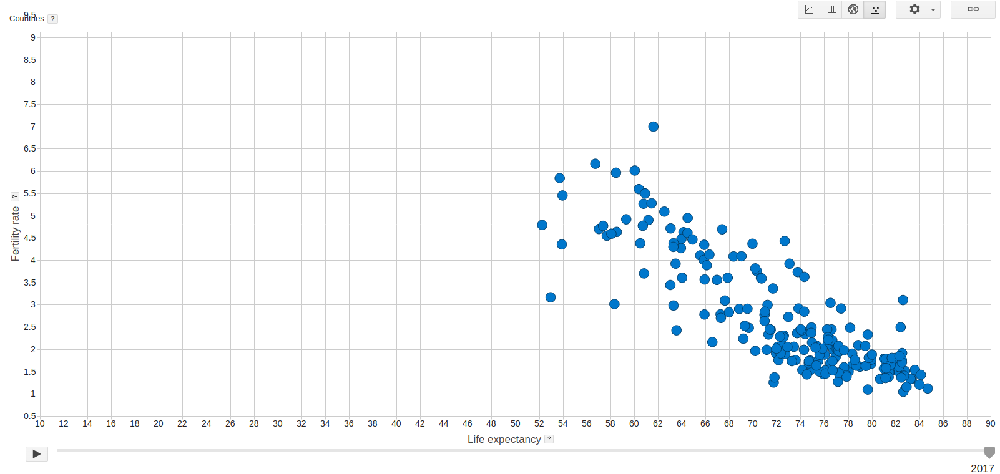
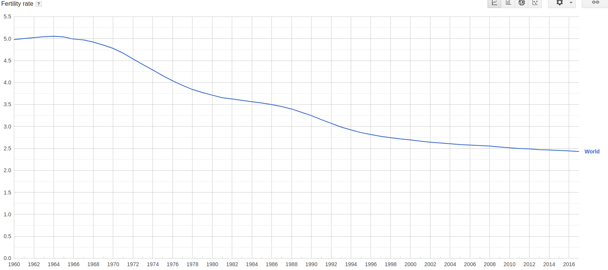
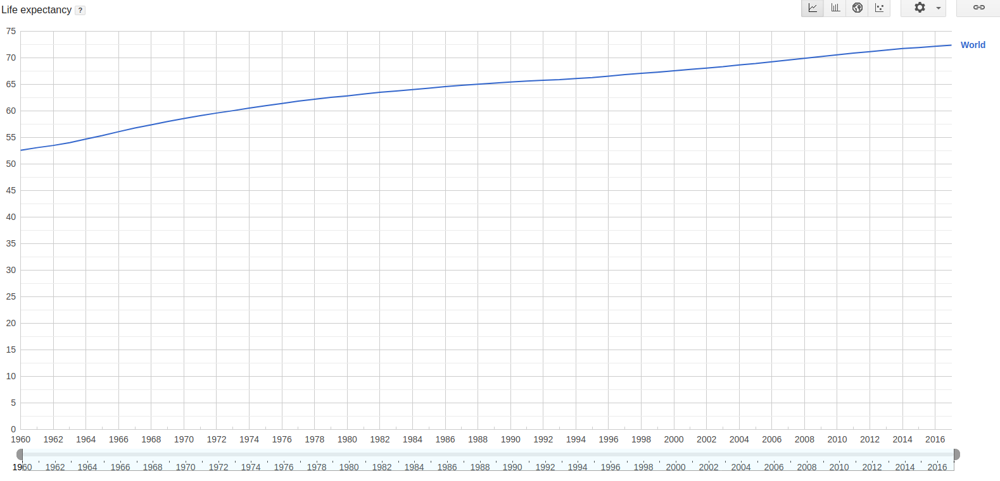
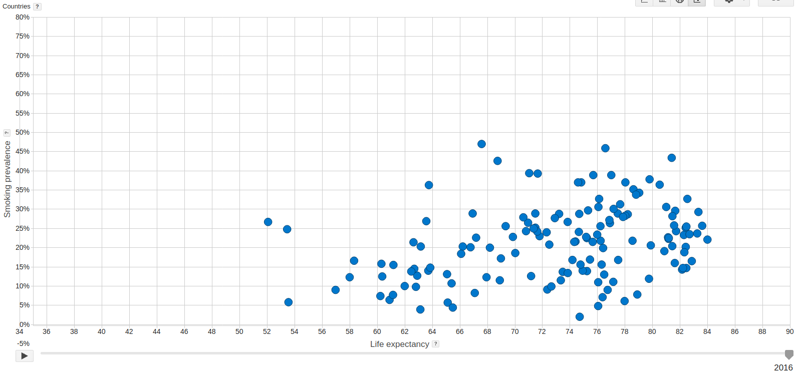
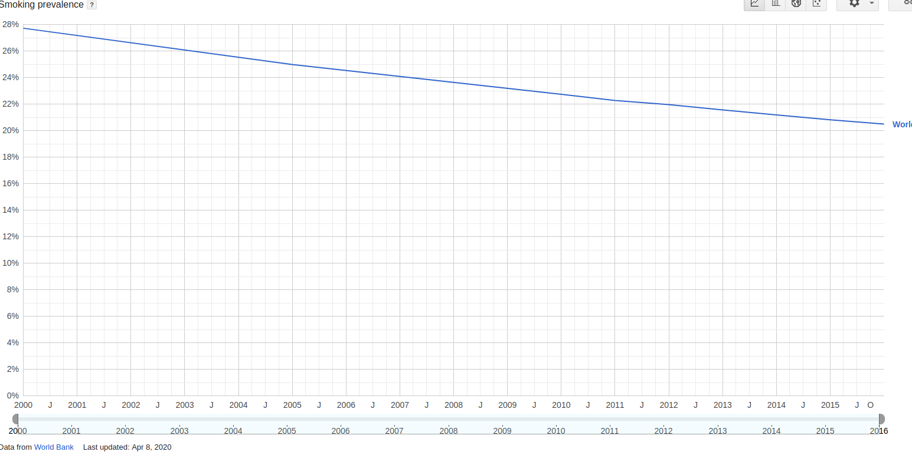
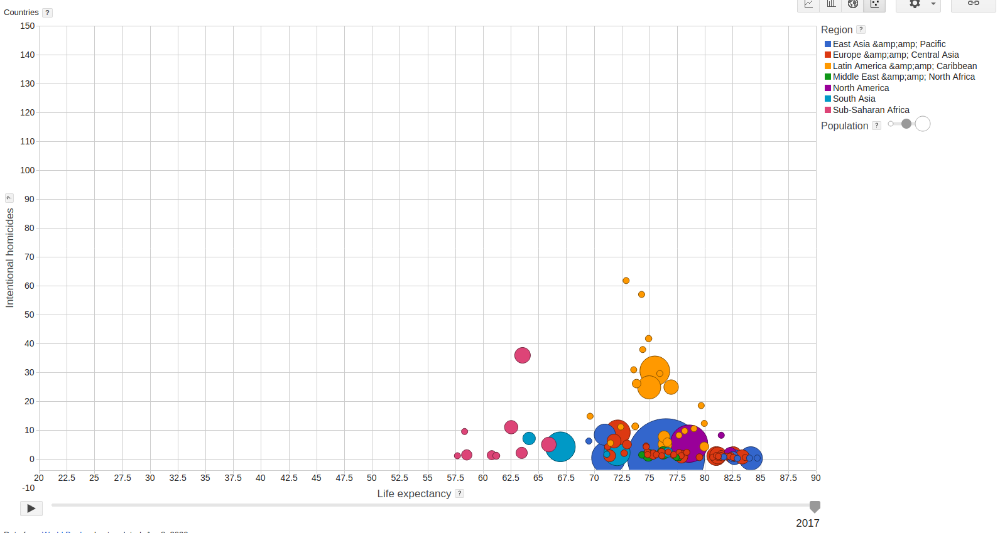
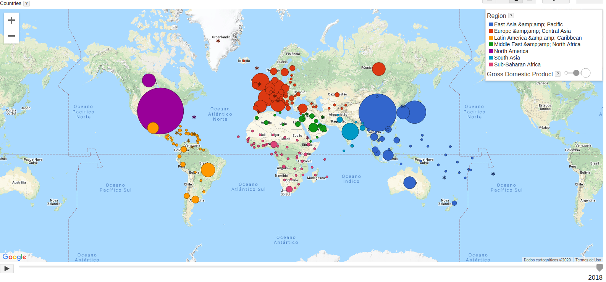
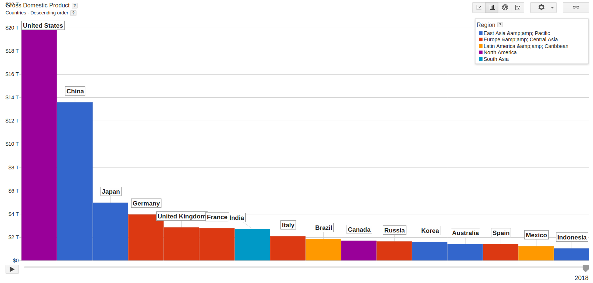

---
output:
  pdf_document: default
  html_document: default
---
# SCC0652 - TAREFA 2

Francisco Rosa Dias de Miranda - 4402962

## 1. Mencione 3 padrões que você acredita serem previsíveis.

Ao realizar uma análise exploratória, notei uma forte correlação linear negativa entre expectativa de vida e taxa de fertilidade (no geral, quanto maior a expectativa de vida, menor a taxa de fertilidade)

Expectativa de vida: tendência a aumentar em todos os países ao longo do tempo, de forma acentuada principalmente nos países mais ricos.

Taxa de fertilidade: tendência a diminuir nos próximos anos, no geral países mais pobres possuem maior taxa de fertilidade.

## 2. Mencione 2 padrões que você considerou surpreendentes.

Suspeitei que uma maior prevalência de fumantes em um país diminuísse a expectativa de vida. Contudo, não há uma relação clara ao observar o scatter plot, embora a taxa de fumantes esteja diminuindo e a expectativa de vida aumentando ao longo dos anos.
    

    

A América Latina possui as maiores taxas de homicídio do mundo.

## 3. Compare o Brasil com países que possuem o mesmo Gross Domestic Product (GDP).

A partir de 2004, o Brasil começou a ganhar posições e permaneceu de 2010 a 2014 como a sétima maior economia do mundo. Em 2018 tivemos o nono maior PIB que, curiosamente, está próximo a países desenvolvidos, como Itália, Reino Unido e Canadá, e também dos emergentes Índia e Rússia.

## 4. Compare o Brasil com países que possuem o Gross Domestic Product (GDP) maior e menor.

Temos aqui uma certa disparidade, pois, como discutido anteriormente, o Brasíl possui o PIB similar ao de alguns países desenvolvidos, embora esteja muito distante deles em outros indicadores (como por exemplo IDH e taxa de anafalbetismo); assim como também de outros países emergentes, que são mais indicatoriamente próximos ao Brasil, como a Índia e Rússia, que, assim como nós, possuem uma grande população e território.
